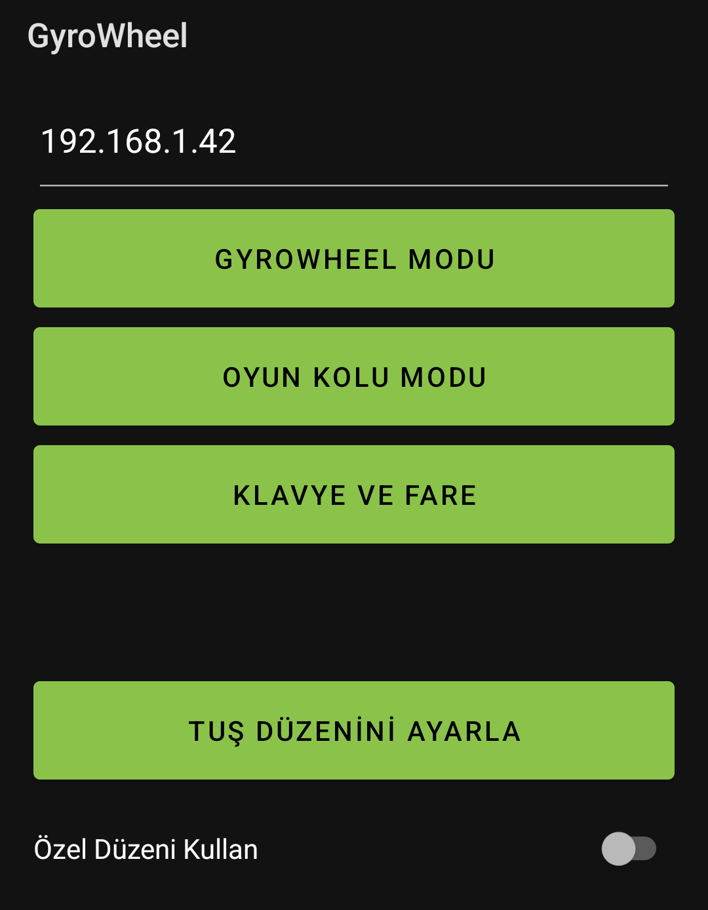
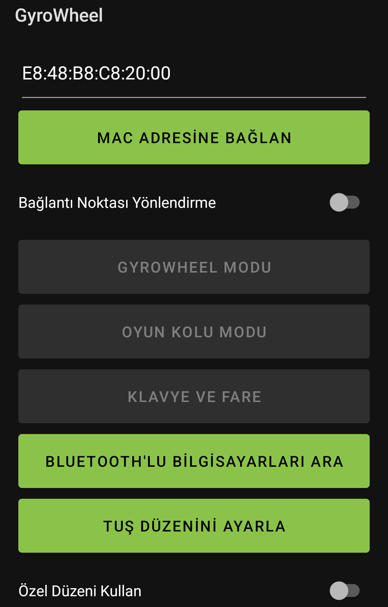
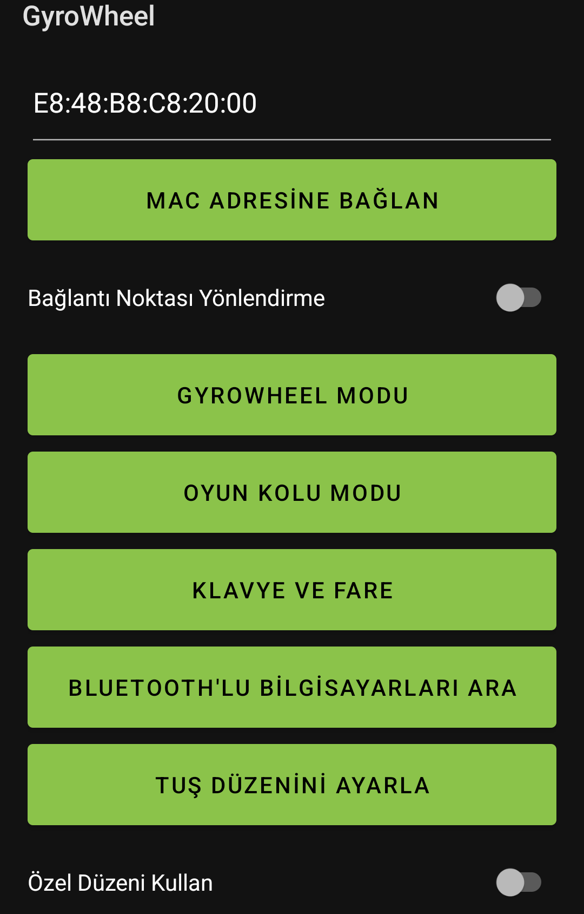
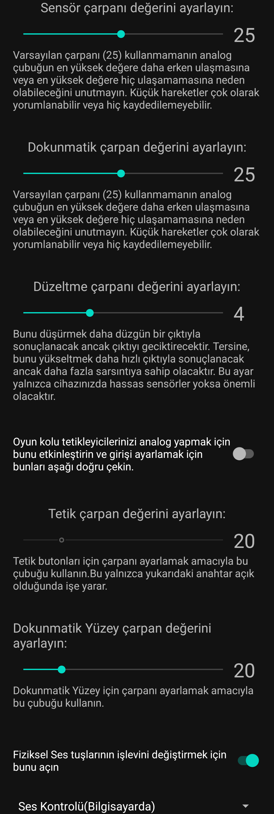

# GyroWheel
For English documentation, please see [readme.md](readme.md).
## Kurulum

Python kurulumu ve teknik detaylarla uğraşmak istemiyorsanız, hazırladığım çalıştırılabilir dosyaları kullanabilirsiniz:

- [x64 çalıştırılabilir dosyasını indir](https://github.com/serdarbsgn/gyrowheel/raw/main/dist/GWListenerX64.exe)   -[Kaspersky Link](https://opentip.kaspersky.com/CED422EF6A694ABE5F112FC066A7D8A29A8CFADB2E05F1CA30AF1B38F8DC00FA)   -[Virustotal Link](https://www.virustotal.com/gui/file/ced422ef6a694abe5f112fc066a7d8a29a8cfadb2e05f1ca30af1b38f8dc00fa)    
- [x86 çalıştırılabilir dosyasını indir](https://github.com/serdarbsgn/gyrowheel/raw/main/dist/GWListenerX86.exe)   -[Kaspersky Link](https://opentip.kaspersky.com/27C65ECA11356002933C02BEABF773D6619424B0560B845F2484259F68792A21)   -[Virustotal Link](https://www.virustotal.com/gui/file/27c65eca11356002933c02beabf773d6619424b0560b845f2484259f68792a21)    
    
Görünüşe göre bazı antivirüsler (muhtemelen ml algoritmaları) yukarıdaki exe'leri kötü amaçlı olarak işaretliyor, bunları kullanmamak tamamen size kalmış, istemiyorsanız aşağıdaki kurulum ii'ye bakın.    
YÜRÜTÜLEBİLİR DOSYALARI KULLANMAK İSTEMİYORSANIZ LÜTFEN KURULUM II'Yİ KULLANIN.    
    
[ViGEm Bus Driver](https://vigembusdriver.com/download/)'ı da indirip yüklemeniz gerekecek. Bilgisayarınız için doğru mimarideki çalıştırılabilir dosyayı kullanın. (Birisi çalışmazsa, diğerini deneyin. ViGEm Bus Driver'ı yüklediğinizden emin olun.)    

Çalıştırılabilir dosyaları kullanmak istemiyorsanız, aşağıya bakın.    

Doğru çalıştırılabilir dosyayı kullanarak çalıştırma seçeneklerini seçin.    

## Kurulum II

Python 3 yüklüyse, [Python'u buradan yükleyin](https://www.python.org/downloads/), ardından gerekli kütüphaneleri yüklemek için `install.bat` dosyasını kullanın. APK'yı telefonunuza yükleyin, ardından bilgisayarınızı ve telefonunuzu aynı ağa bağlayın. (Bluetooth modu için bu gerekli değildir.)    

Çalıştırma seçeneklerini seçmek için `run.bat` dosyasını kullanın.    

## Ağ Modu Bağlantısı

Ağ/UDP modunu kullanmak için, bilgisayarınızda görüntülenen IP'yi telefonunuza yazın. Örneğin, `192.168.1.42:12345`.     

Ağ/UDP modunu kullanmak için, terminalde görüntülenen IP'yi telefonunuza yazın. Örneğin, `192.168.1.42:12345`.    

"AĞ'I KULLAN" seçeneğini seçin ve `192.168.1.42`'yi ilk metin alanına girin. IP'yi doğru bir şekilde girdikten sonra, GyroWheel Modu, Oyun Kolu Modu'nu veya Klavye&Fare modunu kullanın.    

## Bluetooth Modu Bağlantısı

Uygulama, bilgisayarınızın Bluetooth MAC adresini bulup telefon uygulamasına kolayca girmek için görüntülemeyi dener. Eğer adresi algılayamazsa veya birden fazla adres bulursa, doğru adresi manuel olarak girmeniz veya seçmeniz gerekebilir.    

Bluetooth modunu kullanmak için, Bluetooth izinlerinin verildiğinden ve Bluetooth destekli bir bilgisayarınız olduğundan emin olun. Bilgisayarınızın MAC adresini girin (yakınlardaki MAC adreslerini almak için "BLUETOOTH'LU BİLGİSAYARLARI ARA" düğmesini kullanabilirsiniz). Bağlantıyı başlatmak için bilgisayarınızda program aktifken "MAC ADRESİNE BAĞLAN" düğmesini kullanın.    

Bağlandıktan sonra, GYROWHEEL MODU, OYUN KOLU MODU ve Klavye&Fare Modu düğmeleri kullanıma açılacaktır.    

## Ek Bilgiler

Hassasiyet çarpanlarını ve düşük geçiş filtre kaydırıcılarını ayarlayabilir veya tetikleyicileri (LT, RT) analog yapabilirsiniz. Bu, düğmeye basmanın yerine parmağınızı aşağıya doğru hareket ettirmeyi içerir.

Gamepad modunu kullanırken, "TUŞ DÜZENİNİ AYARLA" düğmesini kullanarak buton düzenini düzenleyebilirsiniz. Butonları sürükleyip bırakın veya ölçeklendirmek için sıkıştırın. Özel düzeninizi kullanmak için "Özel Düzeni Kullan" seçeneğini etkinleştirin ve ardından OYUN KOLU MODU düğmesine tıklayın.

"Bağlantı Noktası Yönlendirme" anahtarı, Android'in yerleşik yüksek seviyeli bağlantı işlevini kullanarak bağlanır. Windows'ta "Diğer Bluetooth Ayarları" araması yapın, COM sekmesine gidin ve gelen bir COM portu ekleyin. Windows'un atadığı COM portu değerini girin (varsayılan COM10'dur). Bilgisayarınızda "Start Bluetooth Classic App with Forwarded Port" seçeneğini seçmek için aynı adımları takip edin.

Klavye ve Fare modu yeni eklendi, yakında üzerinde çalışıp daha da geliştireceğim.    
    
Bilgisayarınız artık girişleri almalı ve oyunlarınızda bir denetleyici simüle etmelidir.

Ekranın altındaki düzen düğmesini kullanarak butonları istediğiniz yerlere sürükleyip bırakabilir, ~~hatta ekranın dışında bile yerleştirebilirsiniz~~. Kendi düzeninizi gamepad modunda kullanmak için düzen düğmesinin yanındaki anahtarı etkinleştirin.

Diğer bağlantı yöntemlerini karmaşıklıkları ve yavaşlıkları nedeniyle kaldırdım. Bu deneyim öğretici oldu.

## GyroWheel

Android cihaz ile Windows için Sanal Oyun Kumandası ve Klavye Fare denetimcisi    

### Lisans

Bu proje GNU Genel Kamu Lisansı sürüm 3 (GPLv3) altında lisanslanmıştır. GNU GPLv3 şartlarına göre yeniden dağıtabilir ve/veya değiştirebilirsiniz. Ayrıntılar için [LICENSE](LICENSE) dosyasına bakın.

Bu program, yararlı olacağı umuduyla dağıtılmaktadır, ancak HERHANGİ BİR GARANTI VERİLMEMEKTEDİR; Pazar için uygunluk veya belirli bir amaca uygunluk dahil hiçbir garanti verilmemektedir. Daha fazla bilgi için GNU Genel Kamu Lisansını inceleyin.

Bu programla birlikte GNU Genel Kamu Lisansının bir kopyasını almış olmalısınız. Eğer almadıysanız, [https://www.gnu.org/licenses/](https://www.gnu.org/licenses/) adresinden edinin.

### Üçüncü Taraf Lisansları

Bu proje aşağıdaki kütüphaneleri kullanmaktadır:

- **vgamepad**: MIT Lisansı altında lisanslanmıştır. Ayrıntılar için [LICENSES/vgamepad-LICENSE](LICENSES/vgamepad-LICENSE) dosyasına bakın.
- **pyserial**: BSD Lisansı altında lisanslanmıştır. Ayrıntılar için [LICENSES/pyserial-LICENSE](LICENSES/pyserial-LICENSE) dosyasına bakın.
- **pynput**: LGPLv3 Lisansı altında lisanslanmıştır. Ayrıntılar için [LICENSES/pynput-LICENSE](LICENSES/pynput-LICENSE) dosyasına bakın.

Ayrıca bu sürücüyü kullanmaktadır:

- **ViGEmBus**: BSD Lisansı altında lisanslanmıştır. Ayrıntılar için [LICENSES/vigembus-LICENSE](LICENSES/vigembus-LICENSE) dosyasına bakın.

Bu kütüphanelerin tam lisans metinleri, bu depo içindeki `LICENSES` dizininde bulunmaktadır. Bu projeyi oluşturabilmemi sağladıkları için onlara teşekkür ederim!
