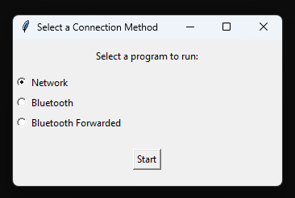
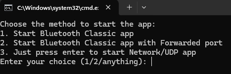
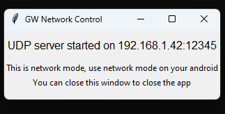
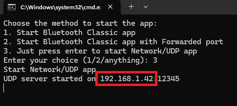
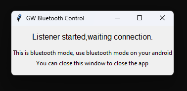
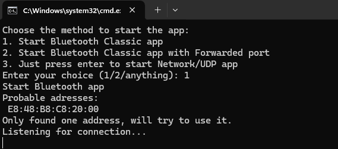
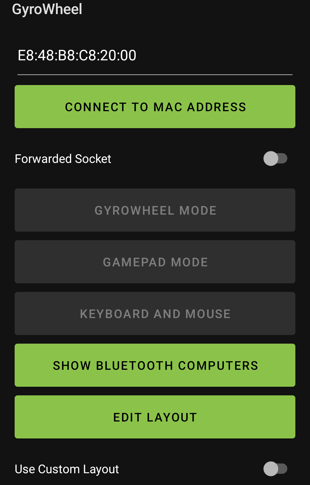
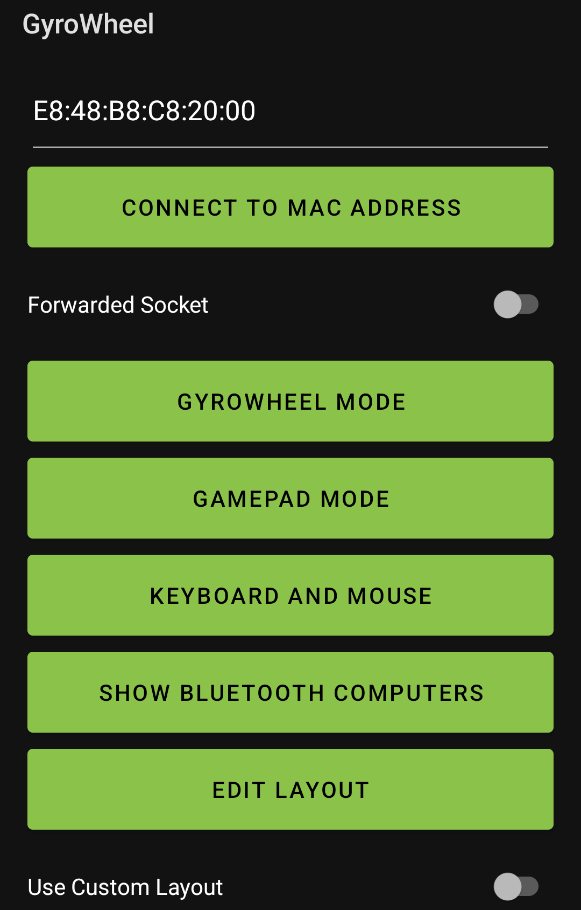
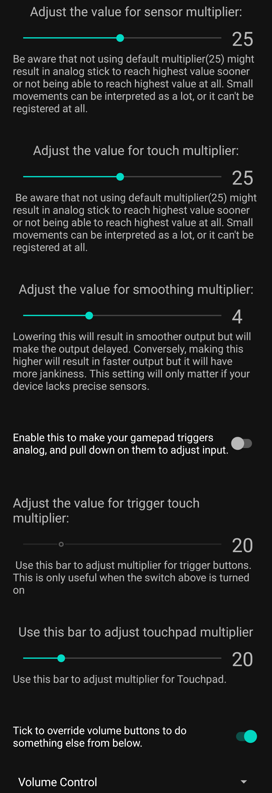

# GyroWheel
Türkçe dökümantasyon için lütfen buraya bakın [readme-tr.md](readme-tr.md).
## Installation

If you prefer to avoid dealing with Python installation and technical details, you can use the executable files I prepared:

- [Download the x64 executable](https://github.com/serdarbsgn/gyrowheel/raw/main/dist/GWListenerX64.exe)   -[Kaspersky Link](https://opentip.kaspersky.com/CED422EF6A694ABE5F112FC066A7D8A29A8CFADB2E05F1CA30AF1B38F8DC00FA)   -[Virustotal Link](https://www.virustotal.com/gui/file/ced422ef6a694abe5f112fc066a7d8a29a8cfadb2e05f1ca30af1b38f8dc00fa)
- [Download the x86 executable](https://github.com/serdarbsgn/gyrowheel/raw/main/dist/GWListenerX86.exe)   -[Kaspersky Link](https://opentip.kaspersky.com/27C65ECA11356002933C02BEABF773D6619424B0560B845F2484259F68792A21)   -[Virustotal Link](https://www.virustotal.com/gui/file/27c65eca11356002933c02beabf773d6619424b0560b845f2484259f68792a21)

Apparently some of the antiviruses(probably ml algorithms) flag above exe's as malicious, it's entirely up to you that you don't use them, see the method ii below.    
PLEASE USE THE METHOD II IF YOU WISH TO NOT USE THE EXECUTABLES.    

You still need to download and install the [ViGEm Bus Driver](https://vigembusdriver.com/download/). Use the correct architecture executable file for your computer. (If one doesn't work, try the other. Be sure to install the ViGEm Bus Driver.)    

Use the correct Run .exe to select run options.

## Installation Method II

If you have Python 3 installed, [install Python here](https://www.python.org/downloads/), then use `install.bat` to install the necessary libraries. Install the APK on your phone, then connect your computer and phone to the same network. (This is not necessary for Bluetooth mode.)

Use `run.bat` to select run options.

## Network Mode Connection

To use Network/UDP mode, write the IP displayed on your computer to your phone. For example, `192.168.1.42:12345`.

To use Network/UDP mode, write the IP displayed on your terminal to your phone. For example, `192.168.1.42:12345`.

Select the "USE NETWORK" option and enter `192.168.1.42` into the first text field. After correctly entering the IP displayed on your PC, use GyroWheel Mode or Gamepad Mode.

## Bluetooth Mode Connection

The application attempts to find and display your computer's Bluetooth MAC address for easy entry in the phone app. If it fails to detect or finds multiple addresses, you may need to enter or select the correct address manually.

To use Bluetooth mode, ensure Bluetooth permissions are granted and that you have a Bluetooth-enabled computer. Enter your PC’s MAC address (you can use the "SHOW BLUETOOTH COMPUTERS" button to get nearby MAC addresses). Use the "CONNECT TO MAC ADDRESS" button to initiate the connection while the script is active on your computer.

Once connected, the GYROWHEEL MODE and GAMEPAD MODE buttons will light up for use.

## Additional Info

You can adjust sensitivity multipliers and low-pass filter sliders, or make triggers (LT, RT) analog. This involves pressing and moving your finger down rather than simply pressing the button.

When using Gamepad mode, you can edit the button layout using the "EDIT LAYOUT" button. Drag and drop buttons or pinch to scale them. Switch the "Use Custom Layout" toggle on before clicking the Gamepad Mode button to use your custom layout.

The "Forwarded Socket" switch connects using Android’s built-in high-level connect function. In Windows, search for "Other Bluetooth Options," navigate to the COM tab, and add an incoming COM port. Enter the COM port value assigned by Windows (default is COM10). Follow the same steps to select "Start Bluetooth Classic App with Forwarded Port" on your computer.

Keyboard and Mouse mode is newly added, I'll tinker around and improve it further soon.    
    
Your computer should now receive inputs and simulate a controller in your games.

Use the edit layout button at the bottom of the screen to drag and drop buttons to your desired locations, ~~even outside the screen if you don’t want to use them~~. Toggle the switch next to the edit button to use your custom layout in gamepad mode.

I removed several other connection methods due to their complexity and slowness. It was a valuable learning experience.

## GyroWheel

Virtual Gamepad for Windows using an Android device

### License

This project is licensed under the GNU General Public License version 3 (GPLv3). You can redistribute it and/or modify it under the terms of the GNU GPLv3. See the [LICENSE](LICENSE) file for details.

This program is distributed in the hope that it will be useful, but WITHOUT ANY WARRANTY; without even the implied warranty of MERCHANTABILITY or FITNESS FOR A PARTICULAR PURPOSE. See the GNU General Public License for more details.

You should have received a copy of the GNU General Public License along with this program. If not, see [https://www.gnu.org/licenses/](https://www.gnu.org/licenses/).

### Third-Party Licenses

This project uses the following libraries:

- **vgamepad**: Licensed under the MIT License. See [LICENSES/vgamepad-LICENSE](LICENSES/vgamepad-LICENSE).
- **pyserial**: Licensed under the BSD License. See [LICENSES/pyserial-LICENSE](LICENSES/pyserial-LICENSE).
- **pynput**: Licensed under the LGPLv3 License. See [LICENSES/pynput-LICENSE](LICENSES/pynput-LICENSE).

Also using this driver:

- **ViGEmBus**: Licensed under the BSD License. See [LICENSES/vigembus-LICENSE](LICENSES/vigembus-LICENSE).

The full license texts for these libraries are included in the `LICENSES` directory of this repository. It is because of them that I was able to create this project, so THANKS!
